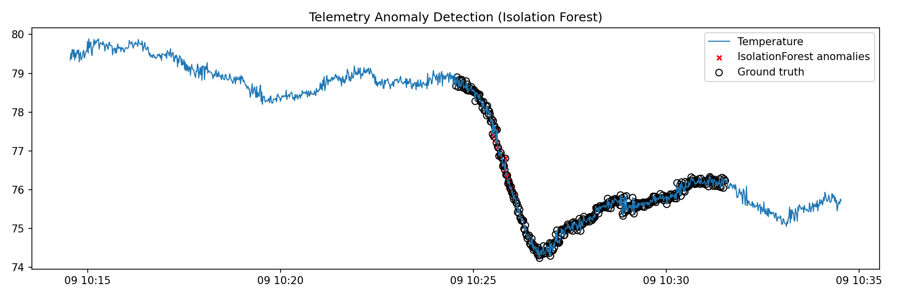
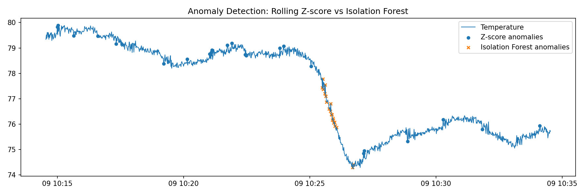

# Telemetry Anomaly Detection  

**Goal**: Show how anomaly detection can spot unusual patterns in time-series telemetry, inspired by Formula 1 sensor data (like temperatures, pressures, or vibrations).

## Problem  
Motorsport cars stream thousands of sensor values in real time. When something goes wrong, such as overheating, pressure drops, or sudden spikes, teams need to catch it fast. We can mimic this challenge using a public dataset with sensor readings over time and test different ways of detecting “strange” behavior.  

## Approach  
- Load telemetry-like data from the SKAB dataset
- Focus on one signal (e.g., Temperature) as our demo channel.
- Engineer simple rolling-window features (mean, standard deviation, short-term change) so models see context, not just raw values.
- Apply two anomaly detection methods:
  - **Rolling z-score (baseline)**: flag values that are far from the rolling average.
  - **Isolation Forest (ML model)**: learn what “normal” looks like and flag outliers.
- Compare their detections and visualize results on time-series charts.

## Tools & Technologies  
- Python, Pandas, NumPy
- scikit-learn (Isolation Forest)
- Matplotlib

## Results (in progress)  
Both methods flag unusual behavior in the signal.
  - Z-score is simple but noisy.
  - Isolation Forest captures broader context and produces cleaner anomaly flags.
    
Example anomalies flagged in the Temperature channel.

**Isolation Forest detections:**
 

**Z-score vs Isolation Forest comparison:**

## Roadmap going forward
- Add an LSTM autoencoder for a deep learning perspective.
- Extend to multiple sensor channels (temperature + pressure + vibration).
- Evaluate models with precision/recall against SKAB’s ground-truth labels.
- Wrap into a streaming pipeline to simulate real-time detection.

## Inspiration  
Having worked on a research paper to do with **cybersecurity anomaly detection**, my interest in other applications, such as **motorsport telemetry analysis**, peaked, and I wanted to further explore the commonalities between the two. Both domains demand speed, accuracy, and resilience under pressure.  
